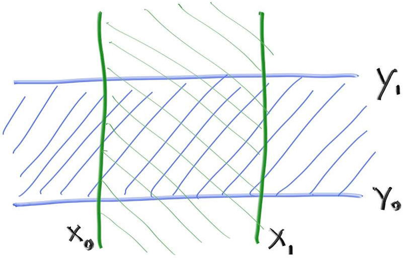
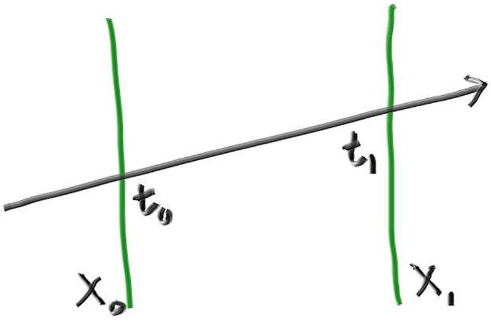
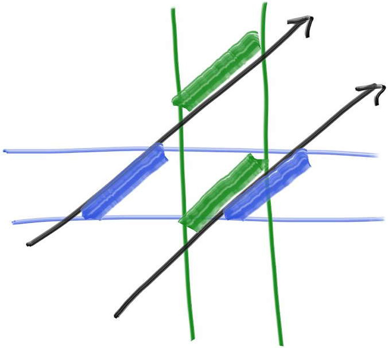

## 3. Bounding Volume Hierarchies

이 파트는 지금까지 우리가 다루는 레이 트레이서에서 가장 어렵고 복잡한 파트입니다. 이 쳅터에서는 코드가 더 빨리 실행될 수 있도록 BVH를 사용하며, BVH는 `hittable` 을 약간 리팩토링하기 때문에 직사각형과 박스를 추가할 때 뒤로 돌아가서 리팩토링할 필요가 없습니다.

레이 트레이서에서 광선-오브젝트 교차는 주요 시간적 병목현상이고 시간은 오브젝트의 수에 선형적으로 증가합니다. 하지만 동일한 모델에 대한 반복적인 탐색이므로 이진 탐색을 할 수 있어야 합니다. 100만에서 10억 개의 광선을 동일한 모델로 쏘기 때문에, 모델을 정렬하는 아날로그를 할 수 있고, 각 광선의 교차는 하위 선형 탐색이 될 수 있습니다. 가장 일반적인 두 가지 분류군은 1) 공간을 나누고 2) 오브젝트를 나누는 것입니다. 후자가 일반적으로 코딩하기 더 쉽고 대부분의 모델에서 실행 속도가 빠릅니다.

---

### 3.1. The Key Idea

프리미티브 세트에 대한 바운딩 볼륨의 핵심 아이디어는 모든 오브젝트을 완전히 둘러싸는 볼륨을 찾는 것입니다. 예를 들어, 오브젝트 10개의 바운딩 구를 계산한다고 가정합니다. 바운딩 구를 교차하지 않는 모든 광선은 10개의 오브젝트 전부와 교차하지 않음이 명백합니다. 광선이 바운딩 구와 교차한다면, 10개의 오브젝트 중 하나와 교차할 수도 있습니다. 따라서 바운딩 코드는 항상 다음의 형태입니다:

```cpp
if (ray hits bounding object)
    return whether ray hits bounded objects
else
    return false
```

핵심은 오브젝트를 하위집합으로 나누는 것입니다. 스크린이나 볼륨을 나누지는 않습니다. 모든 오브젝트는 하나의 바운딩 볼륨 안에 존재하지만 바운딩 볼륨은 겹칠 수 있습니다.

---

### 3.2. Hierarchies of Bounding Volumes

하위 선형 구조를 만들려면 바운딩 볼륨을 계층적으로 만들어야 합니다. 예를 들어, 오브젝트의 집합을 빨간색과 파란색 두 그룹으로 나누고 직사각형 바운딩 볼륨을 사용한다면 다음과 같습니다:


**Figure 1**: Bounding volume hierarchy

파란색과 빨간색 바운딩 볼륨은 보라색 바운딩 볼륨 안에 포함되지만 겹쳐질 수 있고 순서가 지정되지 않습니다. 둘 다 내부에 있을 뿐입니다. 오른쪽 트리의 왼쪽과 오른쪽 자식에는 순서 개념이 없습니다. 단순히 안에 포함되어 있는 것입니다. 코드는 다음과 같습니다:

```cpp
if (hits purple)
    hit0 = hits blue enclosed objects
    hit1 = hits red enclosed objects
    if (hit0 or hit1)
        return true and info of closer hit
return false
```

---

### 3.3. Axis-Aligned Bounding Boxes (AABBs)

이 모든 것을 작동시키려면 올바르게 나누는 방법과 광선이 바운딩 볼륨을 교차하는 방법이 필요합니다. 광선 바운딩 볼륨 교차는 빨라야 하고, 바운딩 볼륨은 매우 작아야 합니다. 실제로 대부분의 모델에서 axis-aligned boxes는 다른 방법들보다 잘 동작합니다. 하지만 이 디자인 선택은 특이한 유형의 모델을 만날 경우 항상 염두에 두어야 할 사항이 있습니다.

지금부터 axis-aligned bounding rectangular parallelepiped(정확한 명칭은 이것입니다)를 axis-aligned bounding boxes 또는 AABB라고 부를 것입니다. AABB를 광선 교차하는 데 사용하는 모든 방법은 괜찮습니다. 그리고 알아야 하는 것은 교차 여부입니다. 교차점이나 법선 또는 표시하려는 오브젝트에 필요한 어떤 것도 필요하지 않습니다.

대부분의 사람들은 "slab" 방법을 사용합니다. 이것은 n차원 AABB가 흔히 "slab"이라고 불리는 n축 정렬 간격(n axis-aligned intervals)의 교차점이라는 것에 근거합니다. 간격은 두 끝점 사이의 점입니다. 예를 들어, 3 < x < 5, 또는 (3, 5)로 표현합니다. 2D에서 두 간격이 겹치면 2D AABB(직사각형)가 됩니다:



**Figure 2**: 2D axis-aligned bounding box

광선이 한 간격에 충돌하려면 먼저 광선이 경계에 충돌하는지 여부를 알아야 합니다. 다시 2D로 예를 들면 광선 파라미터 $t_0$ 와 $t_1$가 있습니다.(광선이 평면에 평행하면 평면의 교차점은 정의되지 않습니다.)



**Figure 3**: Ray-slab intersection

3D에서 이 경계는 평면입니다. 평면 방정식은 $x = x_0$ 와 $x = x_1$ 입니다. 광선이 평면에 충돌하는 곳은 어디일까요? 광선은 $t$ 가 주어졌을 때 위치 $P(t)$ 를 반환하는 함수로 구할 수 있다는 것을 기억하세요:

$$P(t)=A+tb$$

이 방정식은 모든 세 x/y/z 좌표에 적용됩니다. 예를 들어, $x(t) = A_x+tb_x$ . 이 광선은 아래 방정식을 만족하는 파라미터 $t$ 에서 평면 $x=x_0$ 에 충돌합니다:

$$x_0=A_x+t_0b_x$$

그러므로 충돌점 $t$ 은:

$$t_0= \frac{x_0-A_x}{b_x}$$

$x_1$ 에 대해서도 비슷한 식을 구할 수 있습니다:

$$t_1= \frac{x_1-A_x}{b_x}$$

이 1차원 수학을 충돌 테스트로 전환하기 위한 핵심은 충돌하려면 $t$ 간격이 겹쳐야 한다는 것입니다. 예를 들어, 2D에서 녹색과 파란색이 겹치는 것은 충돌하는 경우에만 발생합니다:



**Figure 4**: Ray-slab t-interval overlap

### 3.4. Ray Intersection with an AABB
### 3.5. An Optimized AABB Hit Method
### 3.6. Constructing Bounding Boxes for Hittables
### 3.7. Creating Bounding Boxes of Lists of Objects
### 3.8. The BVH Node Class
### 3.9. Splitting BVH Volumes
### 3.10. The Box Comparision Functions

---

## 출처
[Ray Tracing: The Next Week - 3 Bounding Volume Hierarchies](https://raytracing.github.io/books/RayTracingTheNextWeek.html#boundingvolumehierarchies)